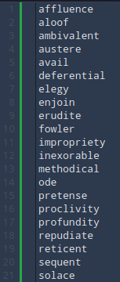
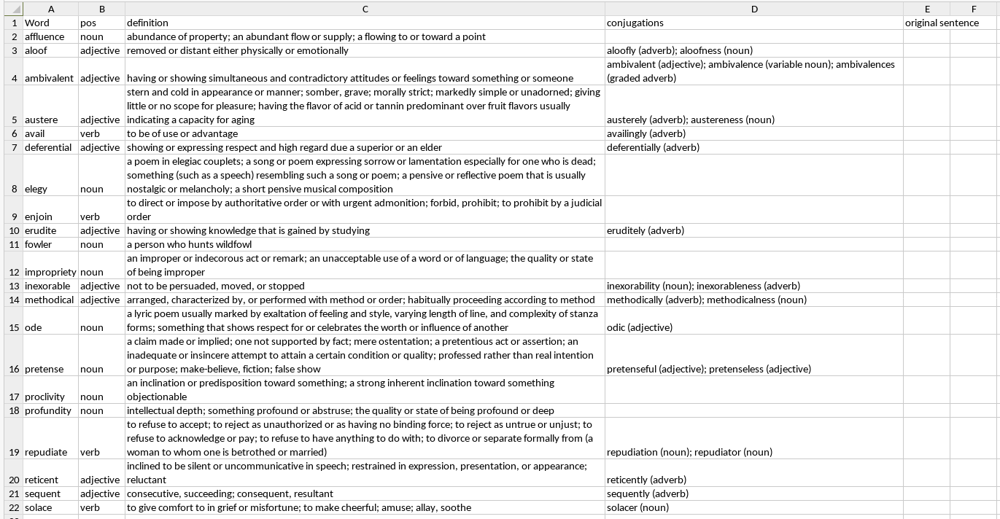

# Scrape Definitions and Conjugations
Given a list of words, scrape the definitions and conjugations from Merriam Webster and Collins Dictionary.  Outputs to a csv file.

This is for my AP Literature homework.  Teacher told us to copy and paste defintions and conjugations from a dictionary of our choice anyway, so just made a program to do it.  Program does not create an original sentence for you, you have to do that yourself.

Example input:

Example output:

Note: The text wrapping and width of the cells have to be done manually

## Requirements
Python, selenium, tqdm, geckodriver.

## Usage
Get a geckodriver from https://github.com/mozilla/geckodriver/releases

Edit `config.py` with the path of your geckodriver and edit some of the other options if you desire.
After program is run, output is a csv file with \t (tab) as the delimiter.
Some conjugations cannot be found on the website, so some manual searching is needed to fill in the blanks.  Also, sometimes the program will output that there is an OR when looking at conjugations.  Check those words manually and make sure that the program output is correct.
